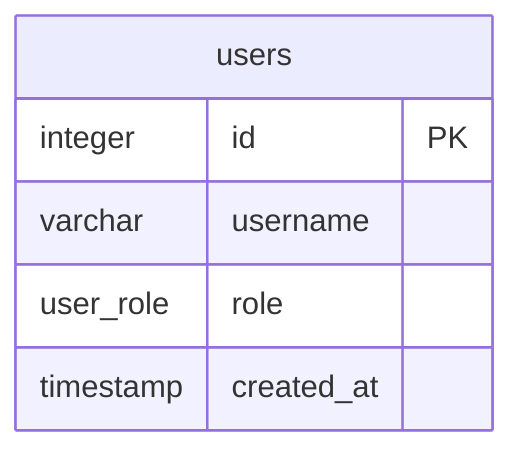
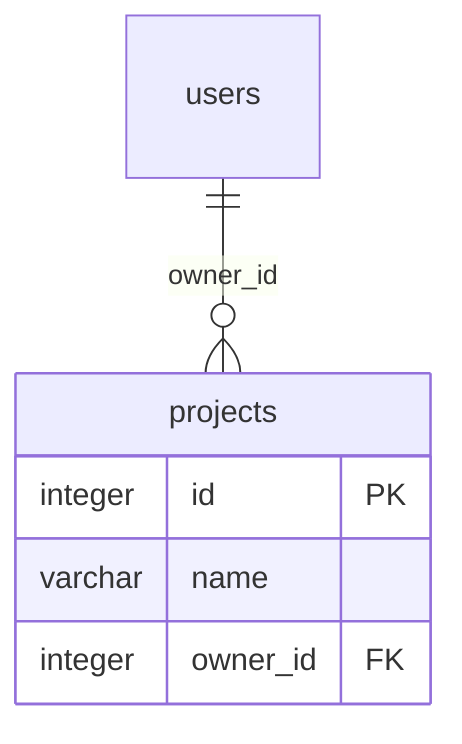

# DBML Integration Plan & Task List

## 1. Background & Architecture

The goal is to introduce native parsing and previewing of **DBML (Database Markup Language)** into OpenStudio, including support for **multi-file DBML projects** using `use` and `reuse` keywords.

### 1.1 Technologies Evaluated
1. **`@dbml/core`**: The core parser library. It takes raw DBML text and converts it into a structural `Database` AST. It supports stateful, multi-file projects natively. **We will use this.**
2. **`@dbml/connector`**: Excluded to maintain parity between VS Code and browser web-page environments.

### 1.2 The `index.dbml` Convention
To solve the "HUGE SVG" problem and provide a clean user experience, OpenStudio will enforce a deliberate convention for DBML projects: **`index.dbml` is the parent documentation file.**

1. **When opening `index.dbml` (Parent)**: 
   The Extension Host compiles the entire project using `index.dbml` as the entry point. It generates the **Full Markdown Documentation**, which includes:
   - ER Diagrams (split by `TableGroup` if defined).
   - Data Dictionary Tables (listing all columns, constraints, and notes).
   - Enums.
   - *Use Case*: Exporting to PDF or HTML for full database documentation.

2. **When opening any other `*.dbml` file (Child)**:
   The Extension Host compiles the project using the active child file as the entry point. It generates **ONLY the Mermaid ER Diagram** code block for that specific module. It will explicitly *not* generate the heavy Markdown tables or text.
   - *Use Case*: Getting a clean, focused visual diagram of a specific module, which is perfect for exporting a small, manageable SVG or PNG.

This strict distinction perfectly maps the user intent: children are for isolated diagram exports, and `index.dbml` is for comprehensive documentation exports.

### 1.3 Export Features Integration
By leveraging the existing `renderMarkdown` pipeline:
* **Export as SVG/PNG**: Automatically captures the target Mermaid ER diagram. Opening a child `.dbml` gives you an isolated sub-SVG.
* **Export as HTML/PDF**: Automatically captures the entire rendered preview. Opening `index.dbml` gives you the full documentation.

---

## 2. Fine-Grained Implementation Todo List

### Phase 1: Environment & Dependencies
- [ ] **Install Parser Dependency**
  - [ ] Navigate to `vscode-ext` directory.
  - [ ] Run `npm install @dbml/core`.

### Phase 2: VS Code Extension Configuration (`package.json`)
- [ ] **Update Activation Events**
  - [ ] Add `onLanguage:dbml` to `"activationEvents"`.
- [ ] **Register Language**
  - [ ] Add an entry in `"contributes.languages"` for DBML (`id: "dbml"`, `extensions: [".dbml"]`).
- [ ] **Update UI Menus & Keybindings**
  - [ ] In `"contributes.menus.editor/title"`, update the `when` condition regex to include `dbml` (e.g., `resourceExtname =~ /^\.(...|dbml)$/`).
  - [ ] Do the same for `"contributes.keybindings"`.

### Phase 3: File Utilities (`src/fileUtils.ts`)
- [ ] **Update `ContentType` Type Definition**
  - [ ] Add `'dbml'` to the exported `ContentType` string union.
- [ ] **Update Supported Extensions**
  - [ ] Add `'.dbml'` to the `SUPPORTED_EXTENSIONS` Set.
- [ ] **Update `getContentType()` Mapping**
  - [ ] Add a `case '.dbml': return 'dbml';` to the switch statement.

### Phase 4: DBML Context-Aware Compiler (`src/dbmlCompiler.ts`)
- [ ] **Create new file `src/dbmlCompiler.ts` in the extension host.**
- [ ] **Implement Multi-file Parser logic**
  - [ ] Import `Parser` from `@dbml/core`.
  - [ ] Create function `compileDbmlToMarkdown(activeFilePath: string, workspaceDir: string): string`.
  - [ ] Recursively read all `.dbml` files in `workspaceDir`.
  - [ ] Instantiate `new Parser()`, loop over found files, and call `parser.setDbmlSource(absolutePath, content)`.
  - [ ] Call `const database = parser.parseDbmlProject(activeFilePath)`.
- [ ] **Implement Diagram Generation (`generateMermaid`)**
  - [ ] Check `database.schemas[0].tableGroups`.
  - [ ] **If TableGroups exist**: Loop through each group and generate a separate `\`\`\`mermaid erDiagram\`\`\`` block.
  - [ ] **If no TableGroups**: Generate a single `\`\`\`mermaid erDiagram\`\`\`` block for all tables and refs.
- [ ] **Implement `generateDataDictionary(database)`**
  - [ ] Output `## Tables` header and Markdown tables for schema details.
  - [ ] Output `## Enums` header and lists.
- [ ] **Implement `index.dbml` Routing Logic**
  - [ ] `const isIndex = path.basename(activeFilePath).toLowerCase() === 'index.dbml';`
  - [ ] `if (isIndex)`: Return `# Database Documentation\n` + Mermaid blocks + Data Dictionary.
  - [ ] `else`: Return **only** the Mermaid ER diagram blocks.

### Phase 5: Extension Host Integration (`src/PreviewPanel.ts`)
- [ ] **Update `_pushDocument(doc)`**
  - [ ] Import `compileDbmlToMarkdown`.
  - [ ] Add condition: `if (contentType === 'dbml')`.
  - [ ] Extract workspace folder URI using `vscode.workspace.getWorkspaceFolder(doc.uri)`.
  - [ ] Call `compileDbmlToMarkdown(filePath, workspaceDir)` to generate the content payload.
  - [ ] Wrap in `try/catch`. On catch, send the error message formatted as Markdown.

### Phase 6: Webview Renderer Logic (`src/webview/renderers/dbml.js` & `main.js`)
- [ ] **Create `src/webview/renderers/dbml.js`**
  - [ ] Create `export async function renderDbml(container, content, filePath, isDark)`.
  - [ ] Call `await renderMarkdown(container, content, filePath, isDark)`.
- [ ] **Update `src/webview/main.js`**
  - [ ] Import `renderDbml`.
  - [ ] Add `case 'dbml':` block in `updatePreview` router.

### Phase 7: Example & Verification
- [ ] **Create Test Files**
  - [ ] Create `example/dbml/index.dbml` containing `use * from './auth'`.
  - [ ] Create `example/dbml/auth.dbml` containing tables and enums.
- [ ] **Verify `index.dbml` Convention**
  - [ ] Open `auth.dbml` -> Verify preview only shows the Mermaid diagram (no dictionary tables). Exporting SVG works perfectly.
  - [ ] Open `index.dbml` -> Verify preview shows the full Markdown documentation (Diagram + Tables). Exporting PDF works perfectly.

---

## 3. Reference Examples

To visualize how multi-file DBML works, how the files are structured, and what the resulting output is, reference the examples below.

### 3.1 Project Folder Structure
A typical multi-file DBML project in the workspace would align as follows:
```
my-database-project/
├── index.dbml                 # Parent / Entry-point file (imports all other modules)
└── schema/                   # Sub-folder hosting separate domain modules
    ├── auth.dbml              # Child file: User accounts and roles
    ├── billing.dbml           # Child file: Subscriptions and payments
    └── projects.dbml          # Child file: Workspaces and projects
```

### 3.2 Child File: `schema/auth.dbml`
```dbml
// schema/auth.dbml
Table users {
  id integer [primary key]
  username varchar
  role user_role
  created_at timestamp
  Note: 'User accounts and roles'
}

Enum user_role {
  admin
  member
}
```

### 3.3 Parent File: `index.dbml`
```dbml
// index.dbml
Project OpenStudio_DB {
  database_type: 'PostgreSQL'
  Note: 'OpenStudio main database schema documentation'
}

// Import the auth schema module using the import-all syntax
use * from './schema/auth'

Table projects {
  id integer [primary key]
  name varchar
  owner_id integer [ref: > users.id]
  Note: 'User workspaces and projects'
}

TableGroup Authentication {
  users
}
```

### 3.4 Generated Markdown (when opening `index.dbml`)
```markdown
# Database Documentation

## ER Diagrams

### TableGroup: Authentication


### Ungrouped Tables & Relations


## Tables

### `users`
*Note: User accounts and roles*

| Column | Type | Constraints | Note |
| --- | --- | --- | --- |
| `id` | integer | Primary Key | |
| `username` | varchar | | |
| `role` | user_role | | |
| `created_at` | timestamp | | |

### `projects`
*Note: User workspaces and projects*

| Column | Type | Constraints | Note |
| --- | --- | --- | --- |
| `id` | integer | Primary Key | |
| `name` | varchar | | |
| `owner_id` | integer | Foreign Key | References `users.id` |

## Enums

### `user_role`
- `admin`
- `member`
```


