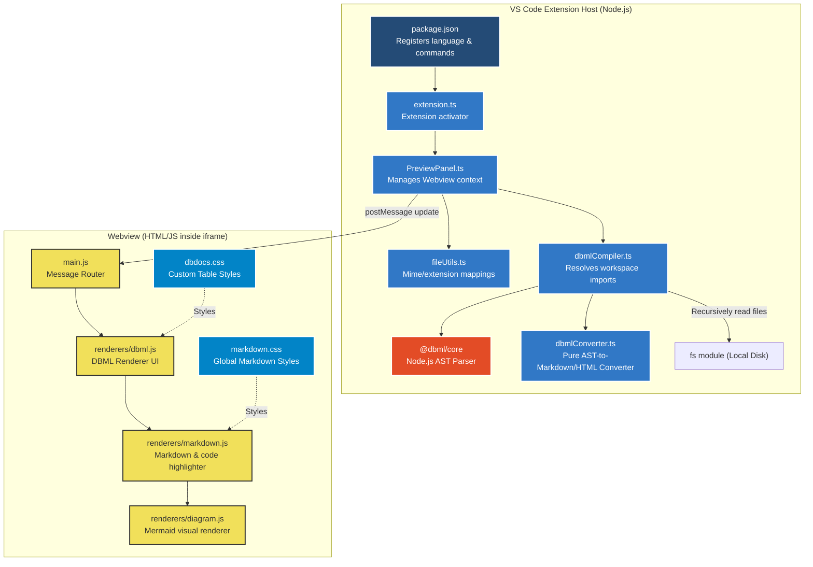
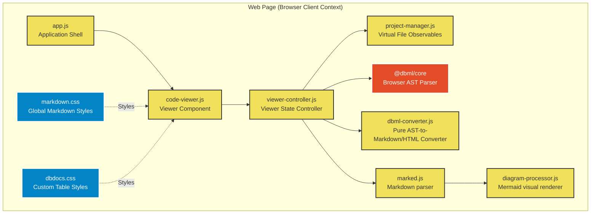

# Implementation Plan: DBML Integration

This implementation plan details the strategy to integrate **DBML (Database Markup Language)** parsing, visualization, and documentation exporting into OpenStudio.

---

## User Review Required

> [!IMPORTANT]
> **No External Cloud Dependencies**
> Consistent with the design goals of OpenStudio, all parsing and compilation is performed locally offline in the Extension Host using `@dbml/core`. No SaaS API keys or cloud services (like `dbdocs.io`) are required.

> [!TIP]
> **Parent (`index.dbml`) vs. Child Routing Convention**
> * **Parent (`index.dbml`)**: Compiles the entire project. Generates full markdown documentation including grouped ER Diagrams, a complete Data Dictionary table, and Enums.
> * **Child (`*.dbml`)**: Compiles the active child schema file as the entrypoint. Generates only the Mermaid ER diagram for that specific module (no data dictionaries), allowing for clean, focused visual SVG/PNG exports.

> [!WARNING]
> **Strict Phase Gating Control**
> Development is strictly serialized:
> * **Phase 1 (Shared Core & Web Page / Browser)** must be fully implemented, deployed, and verified first.
> * **Phase 2 (VS Code Extension)** must **NOT** begin until the verification of Phase 1 is fully complete and approved.

---

## Open Questions

> [!NOTE]
> There are no blocking open questions at this stage. The proposed solution has been validated against the test files in `example/DBML Project` and matches all architectural requirements.

---

## Dependency & Flow Diagrams

OpenStudio runs in two separate environments that do not connect directly. They share a similar architecture but utilize different filesystem bindings and runtimes:

### 1. VS Code Extension Environment Flow
In this environment, the host process runs in Node.js and has raw access to the local disk. It compiles the project offline and sends standard Markdown to the webview.



---

### 2. Web Page (Browser) Environment Flow
In this environment, everything runs inside the browser tab. The workspace is a virtual filesystem loaded into memory via state observables (`project-manager.js`).



---

---

## Proposed Markdown Output Schema (dbdocs.io Quality)

To achieve the documentation quality of `dbdocs.io`, the generated output will be a **hybrid Markdown + HTML document**. This allows us to use Markdown for elements like headers, bullet points, and Mermaid diagrams (which compile automatically), while embedding HTML wrappers and CSS classes for layout, design control, and DOM filtering/searching.

### Syntax Mapping Example (from `schema/fuel_sheet.dbml`)
Below is how the generated hybrid code will look:

```markdown
# Database Documentation: EVA_AFMS
> **Database Type**: Oracle
> 
> EVA Air Fuel Management System (AFMS) Database Schema

---

## 1. ER Diagrams

### TableGroup: FuelSheet
*Visual representation of all tables and relationships belonging to the FuelSheet group.*
\`\`\`mermaid
erDiagram
    FFC_FUEL_SHEET_COST {
        integer WFS_SEQ PK
        integer FFC_NO PK
        varchar DPORT
        varchar FFC_SUPPLIER
        varchar FFC_QTY
        varchar FFC_QTY_TEMPERATURE
        varchar FFC_FUEL_UNIT
        decimal FFC_FUEL_COST
        varchar FFC_FUEL_COST_CURRENCY
        date FFC_INTODATE_LOCAL
    }
    
    style FFC_FUEL_SHEET_COST fill:#e74c3c,stroke:#333,stroke-width:1px
\`\`\`

---

## 2. Data Dictionary

<div class="dbdocs-table-container" data-table="FFC_FUEL_SHEET_COST">

### `FFC_FUEL_SHEET_COST`
<div class="dbdocs-table-note">油單計價資料表 (FFC_FUEL_SHEET_COST)</div>

#### Columns
| Name | Type | Key | Attributes | Note |
| --- | --- | --- | --- | --- |
| `WFS_SEQ` | `integer` | `PK` | `not null` | 油單編號 |
| `FFC_NO` | `integer` | `PK` | `not null` | 油單子編號 |
| `DPORT` | `varchar(3)` | | `not null` | 加油場站 |
| `FFC_SUPPLIER` | `varchar(30)` | | | 供應商 |
| `FFC_QTY_TEMPERATURE` | `varchar(15)` | | `default: '0'` | 加油溫度換算後油量 |
| `FFC_FUEL_COST` | `decimal(24,6)` | | | 油款 |

#### Indexes
| Name | Columns | Unique | Details |
| --- | --- | --- | --- |
| `pk_FFC_FUEL_SHEET_COST` | `(WFS_SEQ, FFC_NO)` | `true` | `PRIMARY KEY` |
| `idx_fuel_sheet_cost_into_date` | `(FFC_INTODATE_LOCAL, DPORT, FFC_SUPPLIER)` | `false` | `INDEX` |

#### Relationships
| Source Column | Target | Relationship | Actions / Details |
| --- | --- | --- | --- |
| `STATION` | `STATION_INFO.STATION` | `many-to-one` | `on update: no action`, `on delete: restrict` |

</div>
```

---

## Proposed Changes (Phase-Sensitive)

### Phase 1: Shared Core & Web Page (Browser) Environment Integration
This phase establishes the core DBML compilation engine and brings full previewing, syntax highlighting, and database search to the web browser interface.

#### 1.1 Core Translation Engine
##### [NEW] [dbml-converter.js](file:///Users/softmobile/Documents/Git/GitHub/a-chhiong/OpenStudio/web-page/src/utils/dbml-converter.js)
* Implement a shared translation engine to convert `@dbml/core` Database AST schemas to Markdown.
* **Hybrid Wrapper Generation**: Wrap each table definition in a `<div class="dbdocs-table-container" data-table="TableName">` wrapper to facilitate CSS styling and live search filtering.
* **Mermaid ER Styles**: Read `headercolor` settings from tables (e.g. `#e74c3c`) and inject `style TableName fill:#e74c3c` statements at the bottom of Mermaid diagrams.
* **Indexes & Keys**: Loop through `table.indexes` to render composite/single column keys, Unique status, and custom index settings.
* **Relationships**: Translate `ref.endpoints` into Mermaid ER cardinality arrows and data dictionary reference tables, checking for updates/deletes actions.

#### 1.2 Web Page Configuration & Editor Highlight
##### [MODIFY] [package.json](file:///Users/softmobile/Documents/Git/GitHub/a-chhiong/OpenStudio/web-page/package.json)
* Add `"@dbml/core": "^6.0.0"` (or latest compatible version) to dependencies.

##### [NEW] [dbdocs.css](file:///Users/softmobile/Documents/Git/GitHub/a-chhiong/OpenStudio/web-page/src/styles/dbdocs.css) & [NEW] [markdown.css](file:///Users/softmobile/Documents/Git/GitHub/a-chhiong/OpenStudio/web-page/src/styles/markdown.css) & [MODIFY] [main.css](file:///Users/softmobile/Documents/Git/GitHub/a-chhiong/OpenStudio/web-page/src/styles/main.css)
* **dbdocs Styles**: Add modular stylesheet `dbdocs.css` defining visual rules for `.dbdocs-table-container` (e.g. card layout, border-radius, modern typography, table notes, headers).
* **Dedicated Markdown Aesthetics**: Create a dedicated `markdown.css` stylesheet defining the complete typography and aesthetics system for the `.markdown-preview` container (premium fonts, clean header borders, borderless row-striped tables, rounded code cards, and custom GitHub-style alert callouts).
* Import both `dbdocs.css` and `markdown.css` in `main.css` (or `app.js`).

##### [MODIFY] [highlight-handler.js](file:///Users/softmobile/Documents/Git/GitHub/a-chhiong/OpenStudio/web-page/src/utils/highlight-handler.js)
* Implement `dbmlLanguage` and `dbmlSupport` using CodeMirror's `StreamLanguage.define()` to tokenize keywords, comments, relationships, and string attributes.
* Register `dbml` under `codeLanguages` to highlight ` ```dbml ` blocks inside Markdown previews.

##### [MODIFY] [editor-controller.js](file:///Users/softmobile/Documents/Git/GitHub/a-chhiong/OpenStudio/web-page/src/components/editor/editor-controller.js)
* Import `dbmlSupport`.
* In `createEditorState()`, map `.dbml` files to the CodeMirror `dbmlSupport` extension so syntax highlighting works natively.

#### 1.3 Web Page Viewer & Search (dbdocs.io Feature Replications)
##### [MODIFY] [viewer-controller.js](file:///Users/softmobile/Documents/Git/GitHub/a-chhiong/OpenStudio/web-page/src/components/viewer/viewer-controller.js)
* Import `Parser` from `@dbml/core` and `compileDbmlToMarkdown` from `../../utils/dbml-converter.js`.
* Route `.dbml` files in `updatePreview()` to `renderDbmlPreview()`.
* **In-Memory Compilation**: Read all loaded project files from `this.host.files` and load them into `Parser` (using both original name and extension-stripped name as keys) to resolve relative schema imports.
* **TOC Indexing**: Automatically generate a clickable Table of Contents (TOC) at the top of `index.dbml` documentation for quick grouping navigation.

##### [MODIFY] [code-viewer.js](file:///Users/softmobile/Documents/Git/GitHub/a-chhiong/OpenStudio/web-page/src/components/viewer/code-viewer.js) & [tool-bar.js](file:///Users/softmobile/Documents/Git/GitHub/a-chhiong/OpenStudio/web-page/src/components/viewer/tool-bar.js)
* **Interactive Search Input**: Replicating `dbdocs.io`, add a search filter box in the toolbar when displaying a DBML spec.
* Filtering text dynamically hides/shows matching table headers and rows in the Markdown output, or automatically scrolls the page to the matching table.

---

### Phase 2: VS Code Extension Host Environment Integration
> [!WARNING]
> **Blocked Status**: Work on this phase must **NOT** begin until Phase 1 has been fully verified and approved.
> 
This phase ports the compiler and preview channel to the VS Code editor once the browser version is fully validated.

#### 2.1 Extension Grammar & Configuration
##### [MODIFY] [package.json](file:///Users/softmobile/Documents/Git/GitHub/a-chhiong/OpenStudio/vscode-ext/package.json)
* Add `"onLanguage:dbml"` to `"activationEvents"`.
* Register `dbml` under `"contributes.languages"`.
* Contribute `dbml.tmLanguage.json` and `markdown-dbml.tmLanguage.json` under `"contributes.grammars"`.
* Install `@dbml/core` dependency.

##### [NEW] [dbml.json](file:///Users/softmobile/Documents/Git/GitHub/a-chhiong/OpenStudio/vscode-ext/language-configuration/dbml.json)
* Configure comments (`//`, `/* */`) and auto-closing brackets.

##### [NEW] [dbml.tmLanguage.json](file:///Users/softmobile/Documents/Git/GitHub/a-chhiong/OpenStudio/vscode-ext/syntaxes/dbml.tmLanguage.json) & [markdown-dbml.tmLanguage.json](file:///Users/softmobile/Documents/Git/GitHub/a-chhiong/OpenStudio/vscode-ext/syntaxes/markdown-dbml.tmLanguage.json)
* TextMate language grammars for syntax coloring in `.dbml` files and embedded markdown code blocks.

#### 2.2 Host Preview Pipelines
##### [MODIFY] [fileUtils.ts](file:///Users/softmobile/Documents/Git/GitHub/a-chhiong/OpenStudio/vscode-ext/src/fileUtils.ts)
* Map `.dbml` files to the `'dbml'` ContentType.

##### [NEW] [dbmlCompiler.ts](file:///Users/softmobile/Documents/Git/GitHub/a-chhiong/OpenStudio/vscode-ext/src/dbmlCompiler.ts)
* Read files recursively from local storage, register them with the parser, run compilation, and call the shared `compileDbmlToMarkdown`.
* *Gotcha Avoidance*: Register under `dbmlConverter.ts` (shared compiler code copied/linked into extension `src`).

##### [MODIFY] [PreviewPanel.ts](file:///Users/softmobile/Documents/Git/GitHub/a-chhiong/OpenStudio/vscode-ext/src/PreviewPanel.ts)
* Resolve workspace folder, invoke `dbmlCompiler.ts` and post the compiled Markdown string payload to the webview.

##### [NEW] [dbml.js](file:///Users/softmobile/Documents/Git/GitHub/a-chhiong/OpenStudio/vscode-ext/src/webview/renderers/dbml.js) & [MODIFY] [main.js](file:///Users/softmobile/Documents/Git/GitHub/a-chhiong/OpenStudio/vscode-ext/src/webview/main.js) & [NEW] [markdown.css](file:///Users/softmobile/Documents/Git/GitHub/a-chhiong/OpenStudio/vscode-ext/src/webview/styles/markdown.css) & [MODIFY] [preview.css](file:///Users/softmobile/Documents/Git/GitHub/a-chhiong/OpenStudio/vscode-ext/src/webview/styles/preview.css)
* Register `'dbml'` renderer and update main switch loop to draw compiled Markdown documents in the VS Code preview panel.
* **Modular Styling**: Create a dedicated `markdown.css` for the webview. Import both `markdown.css` and the new `dbdocs.css` rules into `preview.css` to keep the VS Code Extension aesthetics identical to the browser.

---

## Verification Plan

### Phase 1 Verification (Web Page / Browser)
* **Dependencies**: Run `npm install` in `web-page` and check if server runs with `npm run dev`.
* **Editor Tests**: Open a `.dbml` file in the Web Page editor, verify brackets auto-close and keyword coloring works.
* **Viewer Tests**: Verify child files render only Mermaid ER blocks. Verify `index.dbml` renders the TOC, full dictionaries, styled headercolor tables, and enums.
* **Search Tests**: Enter text in the table search input, and verify the page scrolls to/filters matching tables.

### Phase 2 Verification (VS Code Extension)
* **Compile Tests**: Run `npm run compile` and `npm run lint` in `vscode-ext`.
* **Extension Preview**: Press `F5` to open Extension Development Host. Open `example/DBML Project/index.dbml` and trigger preview (`Cmd+Shift+V`). Verify that full dbdocs-like rendering displays accurately, and child files display diagrams only.

